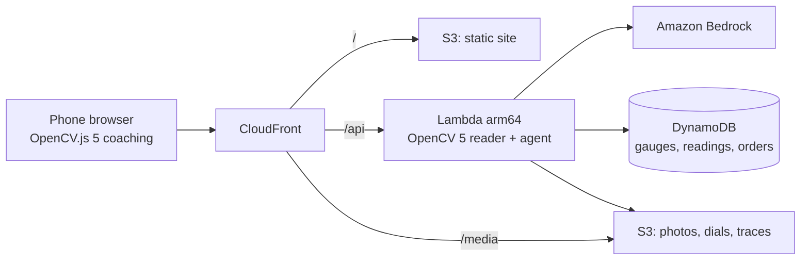

<div align="center">


<br>

[](https://github.com/RohanGlitched/dialed/actions/workflows/ci.yml)
[](#how-it-reads-a-dial)
[](#on-aws)
[](LICENSE)

**[Try it live](https://d3p9dcbwy0l1n8.cloudfront.net)** &nbsp; **[Read a gauge](https://d3p9dcbwy0l1n8.cloudfront.net/read/)** &nbsp; **[Walk the round](https://d3p9dcbwy0l1n8.cloudfront.net/round/)** &nbsp; **[Evidence](https://d3p9dcbwy0l1n8.cloudfront.net/evidence/)**

**[Watch the demo video (4:24)](https://youtu.be/N0-4lAUUxtw)**

</div>

---

**Every analog gauge in a plant, read from a phone photo and acted on.** Dialed straightens the dial, unrolls the scale and reads the needle with **OpenCV 5**. Then an agent decides what happens next: log the reading, ask for a better photo and say exactly why, or hold a work order until a supervisor signs it off. Built for the OpenCV AI Competition 2026.

## Try it in one minute

1. Open **[Read a gauge](https://d3p9dcbwy0l1n8.cloudfront.net/read/)** and pick a sample (real photos from Wikimedia Commons), or upload your own photo of any pressure or temperature gauge.
2. Step through the nine stages: where it found the dial, how it straightened it, where the tick marks say the true centre is, which numbers it read, how it fitted the scale.
3. Open **[The round](https://d3p9dcbwy0l1n8.cloudfront.net/round/)**, tap **TI-201** on the drawing, use its demo photo. The bearing has been warming all week, so the agent holds a work order; open it on the **[approvals desk](https://d3p9dcbwy0l1n8.cloudfront.net/desk/)** and approve or reject it.
4. On a phone, **Use the live camera guide**: OpenCV.js 5 coaches tilt, distance, glare, focus and steadiness before the shutter unlocks.

## Why

Millions of analog gauges will never be replaced with connected sensors. They are read on rounds, by people with clipboards, and the numbers are copied twice before anyone looks at them. A bearing can warm for a week without leaving its normal band; a filter's pressure drop lives in two rows nobody subtracts. Dialed reads the dials from photos, keeps every reading with its evidence, and does that arithmetic on each one.

## How it reads a dial

All classical OpenCV 5, except two small text models from the OpenCV Model Zoo run through `cv.dnn`.

| Stage | OpenCV |
|---|---|
| 1. Find the dial: ellipses fitted to edge contours and bright/dark regions, scored by edge support | `Canny`, `findContours`, `fitEllipse` |
| 2. Straighten: one affine warp maps the rim ellipse to a circle | `warpAffine` |
| 3. Strokes only: black-hat (top-hat on dark faces) keeps needle, ticks and print, drops glare and shading | `morphologyEx` |
| 4. Tick ring: high-pass energy along the angle of the polar image | `warpPolar` |
| 5. True centre: tick marks are radial lines and stay lines under perspective; their intersection is the pivot | `connectedComponentsWithStats`, least squares |
| 6. Needle: collinear line segments through the pivot; a hub circle if visible; the pointer is the end that runs further | `HoughLinesP`, `HoughCircles` |
| 7. Read the numbers: PP-OCRv3 finds text, CRNN reads each box in its own orientation with a confidence | `dnn.TextDetectionModel_DB`, `dnn` CRNN |
| 8. Fit the scale: each ring of numbers fitted on its own (two-scale dials), RANSAC over every reading of every number, then local interpolation | |
| 9. Check the photo: tilt, distance, blur, glare on the needle, a second gauge in the frame; a calibrated confidence | `Laplacian`, logistic model |

On CPU, OpenCV 5's new DNN engine ran the text detector 2 to 4 times faster than the classic engine across our runs, while the classic engine ran the small recogniser 3 to 4 times faster. The reader loads each model with the engine that suits it.

## The agent

A model chooses the next step from six tools: `read_gauge`, `compare_history`, `request_reshoot`, `log_reading`, `hold_work_order`, `flag_wrong_gauge`. Guards in code decide whether each step is allowed:

- nothing is logged below 90% calibrated confidence or with a blocking photo issue;
- re-shoot advice is built only from measured issues;
- a work order needs a measured breach (alarm limit, a week's drift, or the pressure drop across a filter between two paired gauges), and its priority can't be set below what the breach says;
- every figure the model writes is checked against the measurements; unknown figures are struck through on the order;
- a photo whose printed unit or range disagrees with the gauge's registration is flagged, not logged;
- only a person approves a work order.

Model: Amazon Nova Micro on Amazon Bedrock, with Nova Lite as backup, chosen as the cheapest Bedrock model with tool use. A rule engine runs the same tools if neither answers.

## Evidence

Numbers from `scripts/evidence.py` and `scripts/agent_eval.py`; the [Evidence page](https://d3p9dcbwy0l1n8.cloudfront.net/evidence/) has every chart and failure.

| Set | Gauges | Read | Accepted | Accepted within 2% of the scale | Accepted off by >5% | Median error, accepted |
|---|---|---|---|---|---|---|
| Rendered, ordinary photos | 200 | 200 | 178 | 99.4% | 0 | 0.29% |
| Rendered, bad photos (to 50°, glare, blur) | 100 | 74 | 41 | 97.6% | 0 | 0.35% |
| Real photos, development set (Wikimedia Commons, read by eye) | 37 | 29 | 12 | 91.7% | 1 | 0.96% |
| Real photos, blind batch 1, its one run before any fix | 15 | 13 | 4 | 50.0% | 1 | 2.40% |
| Real photos, blind batch 2, after the fixes | 3 | 1 | 0 | – | 0 | – |

Real photos are much harder than rendered ones, and the blind runs show it. Blind batch 1 was labelled by eye and read once; it exposed print in the blank part of a dial being taken for the needle and handwheels being taken for a second gauge. Both were fixed, and that batch joined the development set. Blind batch 2, drawn at random after the fixes, held only 3 scorable dials among 22 photos, too few for a rate; the Evidence page lists each one.

Photos it should decline (two needles, two gauges in one frame, the back of a gauge, no gauge): accepted **1 of 27** in development (an oven thermometer resting below its printed scale) and **0 of 19** in blind batch 2. Agent scenarios: **8/8** with the rule engine, **8/8** with Amazon Nova Micro on Bedrock.

## On AWS



One CloudFormation template (`infra/template.yaml`) creates every resource; `python infra/deploy.py` packages Linux arm64 wheels without Docker, deploys the stack, builds and uploads the site and seeds the sample plant. It runs in Asia Pacific (Sydney), `ap-southeast-2`.

Spending guards: the API function is capped at 5 concurrent runs, model-assisted captures at 400 a day (after that the rule engine decides alone), and each model reply at 600 tokens.

## Deploy to AWS

1. Create an IAM user with access to CloudFormation, Lambda, S3, DynamoDB, CloudFront, IAM (for the function's role), CloudWatch and Bedrock, and export its key as `AWS_ACCESS_KEY_ID` and `AWS_SECRET_ACCESS_KEY`.
2. `pip install -r requirements-dev.txt`, `python scripts/get_models.py`, and `npm ci` in `web/`.
3. `python infra/deploy.py --region ap-southeast-2`. It packages Linux arm64 wheels (no Docker), creates the stack from `infra/template.yaml`, builds and uploads the site, and seeds the sample plant. The first run takes 5 to 15 minutes while CloudFront deploys; it prints the site URL at the end.
4. Optionally set `NEXT_PUBLIC_SITE_URL` to that URL and run it again so the site's links point at itself.

Stack parameters (`LlmOrder`, `BedrockModels`, `DailyModelCap`, `MaxConcurrency`) set the model order and the spending guards. Python dependencies are pinned in `requirements.txt` and `requirements-dev.txt`, and the site's in `web/package-lock.json`.

## Run it locally

```bash
python -m venv .venv && .venv/Scripts/pip install -r requirements-dev.txt   # or .venv/bin/pip (Python 3.12)
python scripts/get_models.py        # the two OpenCV Model Zoo text models, hash-checked
python scripts/seed.py              # the sample pump house with two weeks of history
python -m api.local 3840            # the API
cd web && npm ci && npm run dev -- --port 3850
```

Open http://localhost:3850. Without a model configured, the rule engine makes the decisions.

## Tests and evaluation

```bash
python -m pytest -q                         # reader, guards and API
python vision/synth.py data/synth200 200    # rendered gauges with known answers (and --hard)
python vision/calibrate.py                  # fit the confidence model on its own 600 gauges
python scripts/evidence.py                  # score rendered and real sets, rebuild the evidence data
python scripts/agent_eval.py --model        # eight agent scenarios
```

## Project layout

```
vision/   OpenCV 5 reader, synthetic renderer, calibration, stage export
agent/    round agent: tools, guards, facts, model clients, storage, sample plant
api/      Lambda handler and local server
web/      Next.js static site (drawing-sheet design), OpenCV.js camera guide
infra/    CloudFormation template and deploy script
eval/     real gauge photos with by-eye readings: real and blind1 (development), blind (credited in CREDITS.md)
scripts/  seeding, evidence, scenarios, samples
tests/    pytest
```

## Limits

- Vacuum and compound gauges whose labels carry minus signs or decimals on every number can be misread from a single photo; on a round the gauge's registered range catches it.
- Digital displays, sight glasses and two-needle dials aren't read reliably.
- An idle needle resting on its stop below the first printed number is extrapolated from the nearest numbers and can read a few percent high.
- Below 90% confidence there's no number, only a request for a better photo and the reason.
- It replaces the clipboard, not the safety system.

## Credits

Photos, models and fonts are credited in [CREDITS.md](CREDITS.md). Code is MIT; photos keep their own licences.
